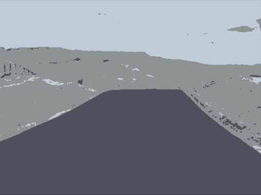

# K-Means Image Segmentation

## Project Overview

This project demonstrates image segmentation using **K-Means clustering** and **OpenCV**.

The approach treats each pixel in an image as a data point represented by its RGB color values. K-Means clustering is then used to group pixels with similar colors into three clusters, producing a simplified segmented version of the original image.

The project demonstrates an application of **unsupervised learning to computer vision and image processing**.

## Input Image

The project uses a street image as the input.

The original image has dimensions of:

* **360 × 480 pixels**
* **3 color channels (RGB)**

The image is stored in the `data/` directory and is loaded by the notebook before processing.

## Image Preprocessing

The following preprocessing steps are applied:

### 1. Color Conversion

OpenCV loads images in BGR format. The image is converted from BGR to RGB before visualization and processing.

### 2. Gaussian Blur

A **3 × 3 Gaussian blur** is applied to the image to smooth the pixel values before clustering.

### 3. Pixel Reshaping

The image is reshaped from:

```text
360 × 480 × 3
```

into:

```text
172,800 × 3
```

Each row represents one pixel, with three values corresponding to its RGB color components.

### 4. Data Type Conversion

The pixel values are converted to `float32` before being passed to the K-Means algorithm.

## K-Means Clustering

The project uses the OpenCV implementation of K-Means:

```python
cv2.kmeans()
```

The clustering configuration is:

| Parameter                |          Value |
| ------------------------ | -------------: |
| Number of clusters (`K`) |              3 |
| Maximum iterations       |            100 |
| Epsilon                  |           0.75 |
| Attempts                 |             10 |
| Initialization           | Random centers |

The three cluster centers obtained from the evaluated run were:

```text
[141, 146, 147]
[192, 203, 216]
[ 78,  81,  93]
```

These cluster centers represent the dominant RGB colors used to reconstruct the segmented image.

## Segmentation Process

After clustering, each pixel is assigned to one of the three clusters.

The pixel is then replaced by the RGB value of its corresponding cluster center.

This produces a simplified image containing three dominant color groups.

## Results

### Original Image


### K-Means Segmented Image



The result demonstrates how K-Means can simplify an image by grouping pixels according to their RGB color similarity.

## Why K-Means?

K-Means is an unsupervised clustering algorithm that groups data points based on similarity without requiring predefined labels.

For this project, each pixel is represented by its RGB values, allowing K-Means to discover groups of pixels with similar colors.

This makes K-Means a simple approach for demonstrating color-based image segmentation.

## Evaluation

This project does not use a supervised ground-truth segmentation mask, so classification metrics such as accuracy, precision, recall, and F1-score are not applicable.

The output is instead evaluated visually by comparing the original image with the resulting segmented image.

## Tools & Technologies

* **Python**
* **OpenCV** — Image processing and K-Means clustering
* **NumPy** — Numerical operations and pixel-array manipulation
* **Matplotlib** — Image visualization
* **Jupyter Notebook** — Development environment

## Project Structure

```text
kmeans-image-segmentation/
│
├── README.md
├── requirements.txt
├── .gitignore
│
├── data/
│   └── street.jpg
│
├── images/
│   ├── street_original.png
│   └── street_segmented.png
│
└── notebooks/
    └── kmeans_image_segmentation.ipynb
```

## Project Outcome

This project demonstrates an end-to-end application of **unsupervised learning for image segmentation**.

The workflow covers:

* Loading an image with OpenCV
* Converting BGR to RGB
* Applying Gaussian blur
* Representing image pixels as RGB feature vectors
* Applying K-Means clustering
* Assigning pixels to clusters
* Reconstructing the segmented image
* Visualizing the original and segmented results

The project provides a practical introduction to applying clustering techniques to computer vision and image-processing tasks.

## Author

**John Medhat**

[GitHub](https://github.com/JohnMedhat)
